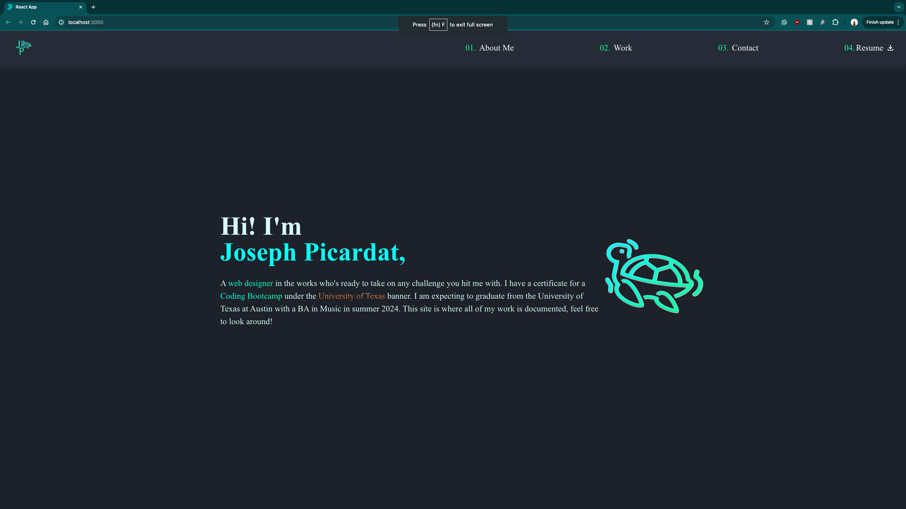

# Joseph Picardat's Portfolio

## Description

What was my motivation?

-   I want to create a site that properly illustrates who I am and the work I have accomplished.

Why did I build this project?

-   This project was built to bring forth an easy representation of my work and achievements.

What problem does it solve?

-   It solves the problem of slowly skimming through readmes' to learn about the projects I have worked on. It also gives the user the ability to get in contact with me.

What did I learn?

-   I learned how to manage different types of frameworks to find which one best fit my project.

## Table of Contents

-   [Usage](#usage)
-   [Questions](#questions)
-   [License](#license)

## Usage

## Questions

Github Profile: josephpicardat

If you need to reach me, you can with through my email: josephpicardat1@gmail.com

## License

(https://opensource.org/licenses/MIT)

Copyright 2024 Joseph Picardat

Permission is hereby granted, free of charge, to any person obtaining a copy of this software and associated documentation files (the "Software"), to deal in the Software without restriction, including without limitation the rights to use, copy, modify, merge, publish, distribute, sublicense, and/or sell copies of the Software, and to permit persons to whom the Software is furnished to do so, subject to the following conditions:

    The above copyright notice and this permission notice shall be included in all copies or substantial portions of the Software.

    THE SOFTWARE IS PROVIDED "AS IS", WITHOUT WARRANTY OF ANY KIND, EXPRESS OR IMPLIED, INCLUDING BUT NOT LIMITED TO THE WARRANTIES OF MERCHANTABILITY, FITNESS FOR A PARTICULAR PURPOSE AND NONINFRINGEMENT. IN NO EVENT SHALL THE AUTHORS OR COPYRIGHT HOLDERS BE LIABLE FOR ANY CLAIM, DAMAGES OR OTHER LIABILITY, WHETHER IN AN ACTION OF CONTRACT, TORT OR OTHERWISE, ARISING FROM, OUT OF OR IN CONNECTION WITH THE SOFTWARE OR THE USE OR OTHER DEALINGS IN THE SOFTWARE.
